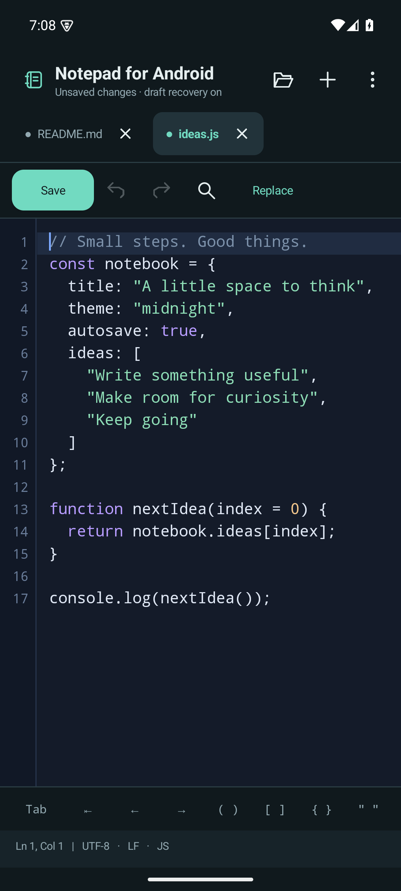
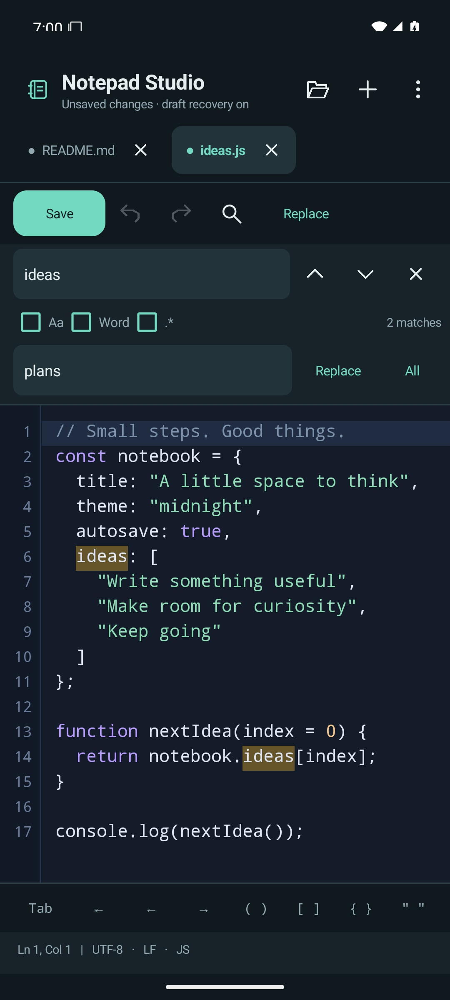

# Notepad for Android

A free, open-source notepad and text editor for **Android 8.0 and later**. Write notes, edit text and code, keep several files open in tabs, and find or replace text with familiar **Ctrl+F** and **Ctrl+H** shortcuts.

**[Download Notepad for Android v1.0.1 (APK)](https://github.com/Shirochi-stack/notepad-for-android/releases/download/v1.0.1/Notepad-for-Android-1.0.1-debug.apk)** · [Release notes](https://github.com/Shirochi-stack/notepad-for-android/releases/tag/v1.0.1) · [Report an issue](https://github.com/Shirochi-stack/notepad-for-android/issues)

The current download is a debug-signed preview APK; the app is not listed on Google Play.

  
  

## Install or update

1. Download the APK above on your Android phone or tablet.
2. Open the downloaded file. If Android asks, allow installation from the browser or file manager you used to open it.
3. Tap **Install**, then open **Notepad for Android**.

To update an existing installation, install the new APK over the app without uninstalling it. Uninstalling removes the app's local drafts and settings. Save important drafts to files before updating.

## Features

- **Notes and files:** document tabs, recent files, open multiple files, Save, Save as, Save all, share text, and Android **Open with** support. Unsaved tabs prompt before closing, and local drafts help recover your work when you reopen the app.
- **Find and replace:** next/previous match, match counts, highlighted results, case sensitivity, whole-word search, regular expressions, and capture-group replacements such as `$1`.
- **Comfortable editing:** undo/redo, line numbers, current-line highlight, go to line, word wrap, horizontal scrolling, adjustable font size, light/dark themes, and document statistics.
- **Code editing:** syntax highlighting for JavaScript, TypeScript, Java, Kotlin, C/C++, Python, JSON, HTML/XML, CSS, Markdown, SQL, shell scripts, and YAML. Includes auto indent, tabs or four spaces, block indent/unindent, duplicate line/selection, toggle line comments, case conversion, and quick bracket insertion.
- **File formats:** UTF-8, UTF-16 LE/BE, and Windows-1252; byte-order mark detection; LF, CRLF, and CR line endings. The app warns before overwriting a file that changed elsewhere and rejects encoding changes that would lose characters.
- **Touch and keyboards:** Android text selection, copy, cut, and paste, plus physical keyboard shortcuts. Primary actions are available through touch controls too.

## Start writing

Create a new tab to start a note, or choose **Open** to select files with Android's system file picker. Use **Save** to write changes to a file, or **Save as** to choose a new name and location. The file picker can access local storage and document providers installed on your device.

Open tabs are kept as local recovery drafts. Recovery does not automatically overwrite the original files: use **Save** when you want to update them. Drafts are written shortly after edits and when the app pauses, so abrupt termination can lose the most recent keystrokes. Save important work explicitly.

Use **Find** or **Ctrl+F** to search the current document, and **Replace** or **Ctrl+H** to open replacement controls. Replacement text is literal unless regex mode is enabled; an empty replacement deletes matches. If no match is selected, the first tap on **Replace** selects one.

## Keyboard shortcuts

Connect a physical keyboard to use these shortcuts.

| Shortcut | Action |
| --- | --- |
| Ctrl+N / Ctrl+O | New tab / open files |
| Ctrl+S / Ctrl+Shift+S | Save / save as |
| Ctrl+W | Close tab |
| Ctrl+Tab / Ctrl+Shift+Tab | Next / previous tab |
| Ctrl+F / Ctrl+H | Find / replace |
| F3 / Shift+F3 | Next / previous match |
| Escape | Close search |
| Ctrl+G | Go to line |
| Ctrl+Z | Undo |
| Ctrl+Y / Ctrl+Shift+Z | Redo |
| Ctrl+A / Ctrl+C / Ctrl+X / Ctrl+V | Select all / copy / cut / paste |
| Tab / Shift+Tab | Indent / unindent |
| Ctrl+D | Duplicate line or selected text |
| Ctrl+/ | Toggle line comment |
| Ctrl+Plus / Ctrl+Minus | Change editor font size |

## Privacy

The app works offline and has no accounts, ads, analytics, or internet permission. It uses Android's file picker instead of requesting broad storage access. Local recovery drafts and settings are excluded from app backups and device transfer.

If you choose a cloud document provider in the file picker, that provider handles its own network access and storage. Text you share is handled by the receiving app.

## Current limits

- Up to **12 open tabs** and **2 MiB per file**. This editor is intended for notes and small text/code files.
- The interface is currently **English**.
- Desktop Notepad++ plugins, code execution, language servers, code folding, a project tree, and search across multiple files are not included. Search and highlighting also have [performance limits](docs/DEVELOPMENT.md#editor-limits).

Notepad for Android is independent software inspired by desktop text editors; it is not affiliated with Notepad++.

## Feedback and license

Found a problem or have a feature request? [Open a GitHub issue](https://github.com/Shirochi-stack/notepad-for-android/issues) and include your app version, Android version, and steps to reproduce it. Avoid attaching private notes or files.

Notepad for Android is free and open source under the [MIT License](LICENSE).

Want to build or contribute? See the [development guide](docs/DEVELOPMENT.md).
